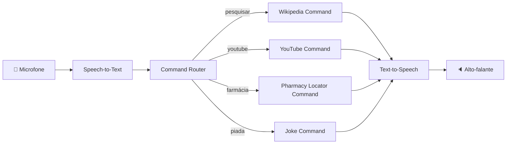

# 🎙️ Virtual Assistant — Assistente Virtual com PLN


Assistente virtual construído do zero em Python, usando Processamento
de Linguagem Natural para converter voz em texto, texto em voz, e
acionar ações automatizadas por comando de voz — pesquisa no
Wikipedia, busca no YouTube e localização da farmácia mais próxima.

Este projeto evolui o desafio original do curso (dois scripts
isolados de exemplo) para uma aplicação com arquitetura modular,
testes automatizados, containerização e pipeline de CI, seguindo boas
práticas de engenharia de software.

---

## Sumário

- [Funcionalidades](#funcionalidades)
- [Arquitetura](#arquitetura)
- [Requisitos](#requisitos)
- [Instalação](#instalação)
- [Configuração](#configuração)
- [Uso](#uso)
- [Estrutura do projeto](#estrutura-do-projeto)
- [Testes](#testes)
- [Docker](#docker)
- [CI/CD](#cicd)
- [Roadmap](#roadmap)
- [Contribuindo](#contribuindo)
- [Licença](#licença)

---

## Funcionalidades

| Módulo | Descrição |
|---|---|
| 🔊 **Text-to-Speech** | Converte texto em áudio falado usando `gTTS`, com suporte a múltiplos idiomas |
| 🎤 **Speech-to-Text** | Converte fala captada pelo microfone em texto usando `SpeechRecognition` (Google Speech API) |
| 📚 **Pesquisa Wikipedia** | Comando de voz que resume qualquer termo pesquisado |
| ▶️ **Busca no YouTube** | Comando de voz que abre uma pesquisa no navegador |
| 💊 **Farmácia mais próxima** | Geolocaliza o usuário por IP e consulta a Overpass API (OpenStreetMap) para achar e traçar rota até a farmácia mais próxima |
| 😂 **Piadas** | Comando bônus mantido do script original do curso |

## Arquitetura

O sistema segue o padrão **Command** para os comandos de voz: cada
ação (Wikipedia, YouTube, farmácia...) é uma classe independente que
implementa uma interface comum e é registrada em um `CommandRouter`.
Isso torna trivial adicionar um novo comando sem alterar o núcleo do
assistente.



Detalhes adicionais de design em [`docs/ARCHITECTURE.md`](docs/ARCHITECTURE.md).

## Requisitos

- Python 3.10+
- Microfone funcional
- Conexão com internet (Google Speech API, gTTS, Wikipedia, Overpass API)
- **Linux:** `portaudio19-dev` (para o `pyaudio`)
- **macOS:** `brew install portaudio`
- **Windows:** normalmente não requer setup extra para `pyaudio`

## Instalação

```bash
# 1. Clone o repositório
git clone https://github.com/<seu-usuario>/virtual-assistant.git
cd virtual-assistant

# 2. Crie e ative um ambiente virtual
python -m venv .venv
source .venv/bin/activate        # Linux/macOS
# .venv\Scripts\activate         # Windows

# 3. Instale as dependências
pip install -r requirements.txt

# Para desenvolvimento (testes, lint):
pip install -r requirements-dev.txt
```

## Configuração

Copie o arquivo de exemplo e ajuste conforme necessário:

```bash
cp .env.example .env
```

| Variável | Descrição | Padrão |
|---|---|---|
| `ASSISTANT_NAME` | Nome do assistente | `Jarvis` |
| `ASSISTANT_LANGUAGE` | Idioma do reconhecimento de voz | `pt-BR` |
| `TTS_LANGUAGE` | Idioma da síntese de fala | `pt` |
| `AUDIO_OUTPUT_DIR` | Diretório de áudios temporários | `./audio_output` |
| `LOG_LEVEL` | Nível de log | `INFO` |
| `LOG_DIR` | Diretório dos logs | `./logs` |
| `AMBIENT_NOISE_DURATION` | Segundos de calibração de ruído | `1` |
| `PHARMACY_SEARCH_RADIUS_M` | Raio de busca de farmácias (metros) | `3000` |

## Uso

```bash
python main.py
```

Comandos de voz suportados:

- **"pesquisar" / "wikipedia"** → pergunta o termo e lê um resumo da Wikipedia
- **"youtube"** → pergunta o termo e abre a busca no YouTube
- **"farmácia"** → localiza e traça rota até a farmácia mais próxima
- **"piada"** → conta uma piada
- **"sair" / "exit"** → encerra o assistente

## Estrutura do projeto

```
virtual-assistant/
├── src/virtual_assistant/
│   ├── config.py              # Configuração centralizada (.env)
│   ├── tts/                   # Módulo text-to-speech
│   ├── stt/                   # Módulo speech-to-text
│   ├── commands/               # Comandos de voz (padrão Command)
│   ├── core/                  # Orquestração (laço principal)
│   └── utils/                 # Logging e utilitários
├── tests/                     # Testes automatizados (pytest)
├── docker/                    # Dockerfile e docker-compose
├── docs/                      # Documentação técnica adicional
├── .github/workflows/         # Pipeline de CI
├── main.py                    # Ponto de entrada
└── requirements.txt
```

## Testes

```bash
pytest
```

Os testes usam mocks para `gTTS`, `playsound` e `speech_recognition`,
então rodam sem necessidade de microfone, alto-falante ou internet.
Cobertura é reportada automaticamente via `pytest-cov` (configurado
em `pytest.ini`).

## Docker

> **Nota:** acesso ao microfone dentro de container só é viável em
> Linux com passthrough de dispositivo ALSA/PulseAudio. Em macOS e
> Windows, rode o assistente localmente fora do Docker.

```bash
docker compose -f docker/docker-compose.yml up --build
```

## CI/CD

O pipeline em `.github/workflows/ci.yml` roda automaticamente em
todo `push` e `pull request` para `main`/`develop`:

1. Lint com `flake8`
2. Testes com `pytest` + cobertura
3. Build da imagem Docker

## Roadmap

- [ ] Suporte a wake word ("Ei, Jarvis") via `porcupine` ou similar
- [ ] Integração com API de previsão do tempo
- [ ] Interface web opcional (FastAPI) para configuração remota
- [ ] Suporte a reconhecimento offline (Vosk)

## Contribuindo

Contribuições são bem-vindas! Veja [`CONTRIBUTING.md`](CONTRIBUTING.md)
para o fluxo de branches, padrão de commits e checklist de pull request.

## Licença

Distribuído sob a licença MIT. Veja [`LICENSE`](LICENSE) para mais detalhes.
