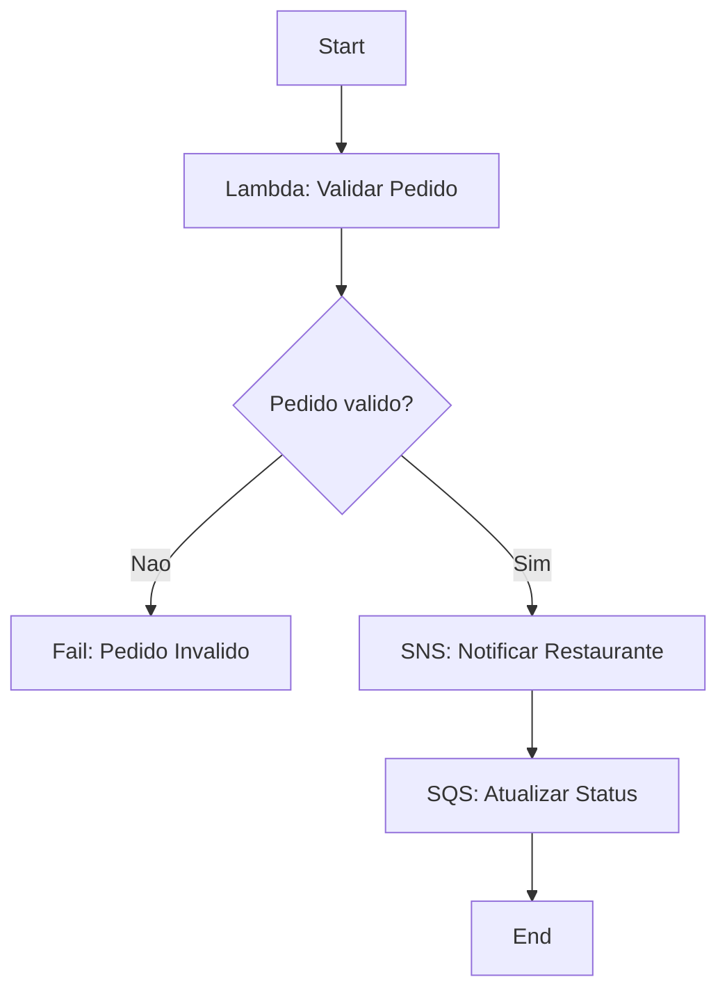
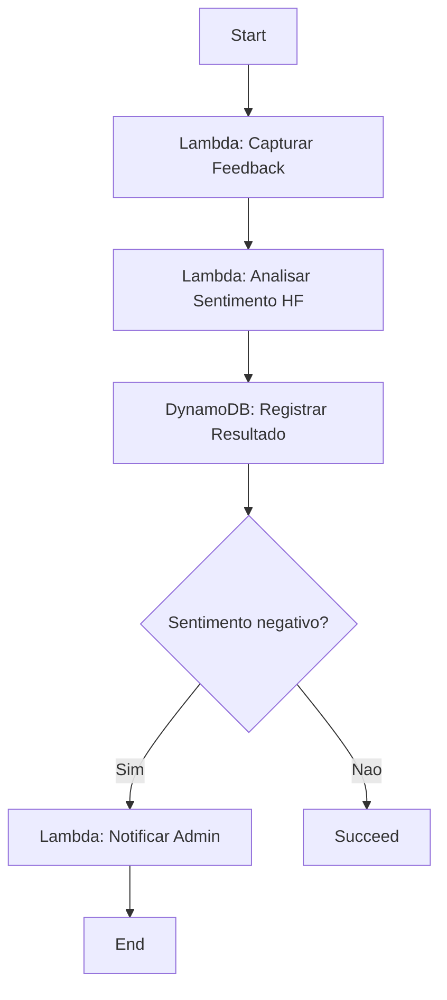

# Diagramas do Assistente de Delivery

## 1. Arquitetura geral

```
Usuario (App de Delivery)
      |
      v
API Gateway (POST /pedidos)
      |
      v
Lambda: api-iniciar-pedido
      |
      v
+-------------------------------------------------------------+
| STEP FUNCTIONS: assistente-delivery-pedido                  |
|                                                               |
|  ValidarPedido (Lambda) --DynamoDB(Pedidos)                  |
|        |                                                      |
|        v                                                      |
|  PedidoValido? --(nao)--> Fail: PedidoInvalido               |
|        | (sim)                                                |
|        v                                                      |
|  NotificarRestaurante (SNS: novo-pedido-restaurante)          |
|        |                                                      |
|        v                                                      |
|  AtualizarStatusFila (SQS: status-pedido)                     |
+-------------------------------------------------------------+
      |
      v
+-------------------------------------------------------------+
| STEP FUNCTIONS: assistente-delivery-notificacoes              |
|  GerarMensagem (Lambda) -> EnviarPush (Lambda -> SNS)          |
+-------------------------------------------------------------+

+-------------------------------------------------------------+
| STEP FUNCTIONS: assistente-delivery-ia-sentimento              |
|                                                               |
|  CapturarFeedback (Lambda)                                    |
|        |                                                      |
|        v                                                      |
|  AnalisarSentimento (Lambda -> Hugging Face Inference API)     |
|        |                                                      |
|        v                                                      |
|  RegistrarResultado (DynamoDB: FeedbacksPedidos)               |
|        |                                                      |
|        v                                                      |
|  BomOuRuim? --(Negative)--> NotificarAdmin (Lambda -> SNS)     |
|        | (default)                                            |
|        v                                                      |
|      Sucesso                                                  |
+-------------------------------------------------------------+

CloudWatch monitora Logs/Metricas/Alarmes de todos os componentes acima.
```

## 2. Workflow de pedido (fluxograma)

```
[Start]
   |
   v
[Lambda: Validar Pedido]
   |
   v
<Pedido valido?> --No--> [Fail: Pedido Invalido]
   |Yes
   v
[SNS: Notificar Restaurante]
   |
   v
[SQS: Atualizar Status]
   |
   v
[End]
```

## 3. Workflow de IA (fluxograma)

```
[Start]
   |
   v
[Lambda: Capturar Feedback]
   |
   v
[Lambda: Analisar Sentimento (Hugging Face)]
   |
   v
[DynamoDB: Registrar Resultado]
   |
   v
<Sentimento negativo?> --Yes--> [Lambda: Notificar Admin] --> [End]
   |No
   v
[Succeed: Sucesso]
```

## 4. Mermaid (renderiza no GitHub automaticamente)




