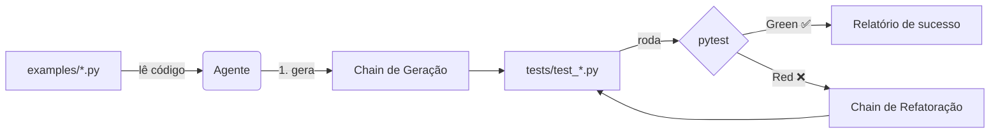

# 🧪 Langchain Test Generator

[](.github/workflows/ci.yml)
[](#-requisitos)
[](#)
[](#-licença)

> Um **agente de IA** que lê um módulo Python e gera automaticamente um
> arquivo de testes `pytest` — com casos de sucesso e falha — executando
> um ciclo **TDD (Red → Green → Refactor)** até os testes passarem.

---

## 📑 Sumário

- [Visão geral](#-visão-geral)
- [Arquitetura](#-arquitetura)
- [Requisitos](#-requisitos)
- [Instalação](#-instalação)
  - [Opção A — Google Colab (recomendado)](#opção-a--google-colab-recomendado)
  - [Opção B — Ambiente local](#opção-b--ambiente-local)
- [Configuração das credenciais](#-configuração-das-credenciais)
- [Uso](#-uso)
- [Estrutura de pastas](#-estrutura-de-pastas)
- [Ciclo TDD explicado](#-ciclo-tdd-explicado)
- [CI/CD](#-cicd)
- [Boas práticas e armadilhas](#-boas-práticas-e-armadilhas)
- [Como subir para o GitHub](#-como-subir-para-o-github)
- [Roadmap](#-roadmap)
- [Licença](#-licença)

---

## 🎯 Visão geral

| | |
|---|---|
| **Entrada** | Um arquivo `.py` em `examples/` |
| **Saída** | Um arquivo `tests/test_<nome>.py` executável com `pytest` |
| **Provedor de LLM** | Azure OpenAI (créditos de trial) com **fallback automático** para Google Gemini (gratuito) |
| **Orquestração** | LangChain (LCEL: prompt \| llm \| parser) + agente customizado |
| **Ambiente recomendado** | Google Colab (zero impacto no disco local) |

Este projeto atende ao desafio proposto no curso, cobrindo — nesta ordem —
os três pilares: **Testes de Software → Agentes de IA → LangChain**.

---

## 🏗️ Arquitetura



Detalhes completos — incluindo o diagrama de fallback Azure ↔ Gemini e a
justificativa de design do agente — estão em
[`docs/ARCHITECTURE.md`](docs/ARCHITECTURE.md).

---

## ✅ Requisitos

- Python 3.11+ (ou Google Colab, que já vem pronto)
- Uma das opções de LLM:
  - Créditos de trial do **Azure OpenAI**, **ou**
  - Uma chave gratuita do **Google Gemini** ([aistudio.google.com/apikey](https://aistudio.google.com/apikey))

---

## 📦 Instalação

### Opção A — Google Colab (recomendado)

Basta abrir
[`notebooks/LangChain_Test_Generator_Colab.ipynb`](notebooks/LangChain_Test_Generator_Colab.ipynb)
no Colab (`Arquivo → Abrir notebook → GitHub`) e rodar as células em ordem.
O próprio notebook clona o repositório, instala tudo e pede as chaves de
API com segurança (`getpass`, sem aparecer em texto).

### Opção B — Ambiente local

```bash
git clone https://github.com/SEU_USUARIO/langchain-test-generator.git
cd langchain-test-generator

python -m venv .venv
source .venv/bin/activate        # Windows: .venv\Scripts\activate

pip install -r requirements.txt
cp .env.example .env              # depois edite o .env com suas chaves
```

---

## 🔑 Configuração das credenciais

Edite o arquivo `.env` (nunca faça commit dele — já está no `.gitignore`):

```ini
LLM_PROVIDER=azure

AZURE_OPENAI_API_KEY=...
AZURE_OPENAI_ENDPOINT=https://SEU-RECURSO.openai.azure.com/
AZURE_OPENAI_API_VERSION=2024-08-01-preview
AZURE_OPENAI_DEPLOYMENT_NAME=gpt-4o-mini

GOOGLE_API_KEY=...
GEMINI_MODEL=gemini-1.5-flash
```

> 💡 **Sem custo garantido:** o `src/llm_provider.py` tenta o Azure primeiro
> e, se detectar erro de cota/autenticação (ex.: créditos de trial
> esgotados), **cai automaticamente para o Gemini gratuito** — sem
> precisar mudar código.

---

## 🚀 Uso

```bash
# Gera (e corrige, se necessário) os testes para examples/calculadora.py
python -m src.cli calculadora

# Forçando um provedor específico
python -m src.cli validador_cpf --provider gemini

# Rodando toda a suíte de testes manualmente
pytest -v
```

Cada execução gera:
- `tests/test_<modulo>.py` — o arquivo de teste gerado/corrigido
- `logs/run.log` — log estruturado da execução
- `logs/report_<modulo>.md` — relatório em Markdown do ciclo TDD

---

## 🗂️ Estrutura de pastas

```
langchain-test-generator/
├── README.md
├── requirements.txt
├── pyproject.toml
├── .env.example
├── .gitignore
├── src/
│   ├── config.py          # Configurações centralizadas (.env)
│   ├── llm_provider.py    # Fábrica de LLM com fallback Azure → Gemini
│   ├── prompts.py         # Templates de geração e refatoração
│   ├── chains.py          # Chains LCEL (prompt | llm | parser)
│   ├── tools.py           # Ferramentas: ler, escrever, rodar pytest
│   ├── agent.py           # Orquestrador do ciclo TDD
│   ├── logger_setup.py    # Logging + relatório Markdown
│   └── cli.py             # Interface de linha de comando
├── examples/
│   ├── calculadora.py     # Exemplo simples
│   └── validador_cpf.py   # Exemplo mais complexo
├── tests/
│   ├── test_calculadora.py
│   └── test_validador_cpf.py
├── notebooks/
│   └── LangChain_Test_Generator_Colab.ipynb
├── docs/
│   └── ARCHITECTURE.md
└── .github/workflows/
    ├── ci.yml             # Testes + cobertura em cada push/PR
    └── release.yml        # Empacotamento + Release ao criar tag
```

---

## 🔄 Ciclo TDD explicado

| Fase | O que acontece no código |
|---|---|
| **Red** | `agent.run()` gera a primeira versão do teste e já sabemos que ainda não foi validado |
| **Green** | `run_pytest()` executa o arquivo; se passar, o ciclo termina com sucesso |
| **Refactor** | Se falhar, a saída **real** do pytest é enviada de volta ao LLM (`build_refactor_chain`), que corrige o teste — repetindo até `MAX_TDD_ITERATIONS` (padrão: 3) |

Isso transforma o conceito teórico de TDD (visto na etapa de fundamentos)
em um laço de feedback automático entre o LLM e o ambiente real de testes.

---

## ⚙️ CI/CD

- **CI** (`ci.yml`): a cada `push`/`pull request` na branch `main`, roda
  `pytest` com cobertura em Python 3.11 e 3.12, publicando o relatório de
  cobertura como artefato do GitHub Actions.
- **CD/Deploy** (`release.yml`): ao criar uma tag `vX.Y.Z`, o projeto é
  empacotado (`build`) e uma **Release do GitHub** é publicada
  automaticamente com os artefatos — um "deploy" leve e sem custo,
  adequado para um projeto de portfólio/curso.

---

## 🛡️ Boas práticas e armadilhas

- ✅ Usamos **LCEL** (`prompt | llm | parser`) em vez da `LLMChain`
  clássica, que está deprecada.
- ✅ O parser remove blocos ```` ```python ```` que o LLM às vezes insere
  mesmo quando instruído a não fazer isso — nunca confie 100% na saída
  bruta de um LLM.
- ✅ Segredos ficam só em `.env` (fora do Git); o repositório traz apenas
  `.env.example`.
- ⚠️ **Armadilha comum**: pedir ao LLM para gerar testes sem mostrar o
  código-fonte real leva a testes genéricos/alucinados. Por isso sempre
  enviamos o conteúdo real do módulo no prompt.
- ⚠️ **Armadilha comum**: parar no primeiro erro do ciclo TDD sem repassar
  a saída real do pytest ao modelo. Sem o erro real, o LLM "adivinha" a
  correção. Por isso o `REFACTOR_PROMPT` sempre recebe `pytest_output`.
- ⚠️ Cuidado com **limites de cota** do Azure trial — é por isso que este
  projeto tem fallback automático para o Gemini gratuito.

---

## 🗺️ Roadmap

- [ ] Suporte a múltiplos arquivos de uma vez (`python -m src.cli --all`)
- [ ] Badge de cobertura automática (Codecov)
- [ ] Modo "agente ReAct" opcional usando `as_langchain_tools`
- [ ] Suporte a outros frameworks de teste (unittest, nose2)

---

## 📄 Licença

Distribuído sob a licença MIT. Veja `LICENSE` para mais detalhes.
