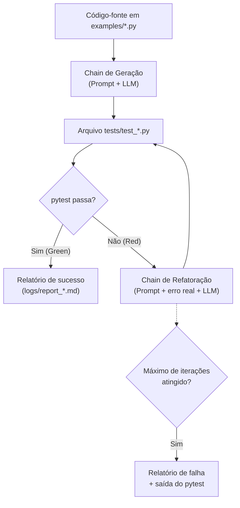
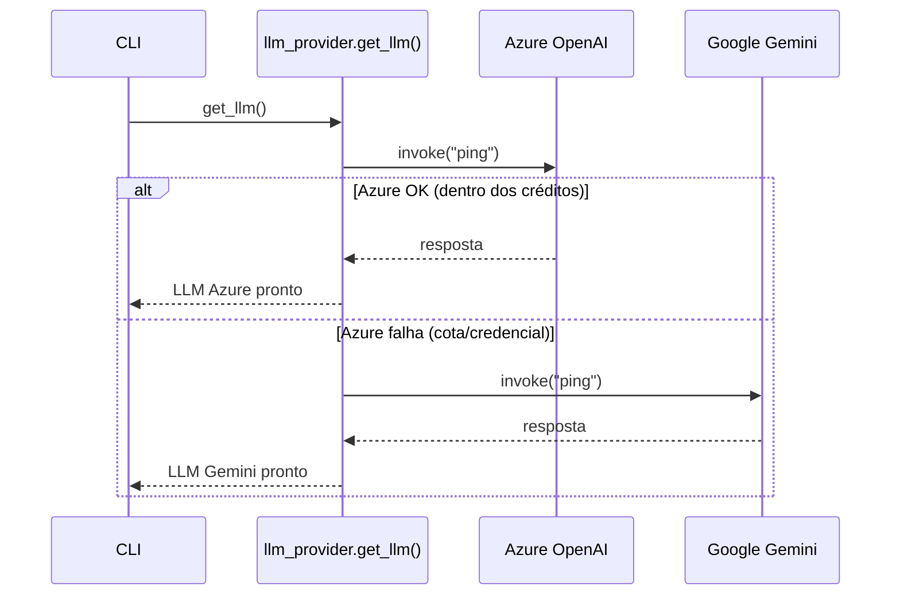

# Arquitetura do Projeto

## Visão geral do fluxo (ciclo TDD automatizado)

## Camadas do sistema

| Camada | Arquivo | Responsabilidade |
|---|---|---|
| Configuração | `src/config.py` | Centraliza leitura de variáveis de ambiente |
| Provedor de LLM | `src/llm_provider.py` | Fábrica com fallback automático Azure → Gemini |
| Prompts | `src/prompts.py` | Templates de geração e refatoração de testes |
| Chains (LCEL) | `src/chains.py` | Composição Prompt \| LLM \| Parser |
| Ferramentas | `src/tools.py` | Ler código, escrever teste, rodar pytest |
| Agente | `src/agent.py` | Orquestra o ciclo Red-Green-Refactor |
| Observabilidade | `src/logger_setup.py` | Logging + relatório Markdown por execução |
| Interface | `src/cli.py` | Comando de linha para rodar tudo |

## Por que um orquestrador determinístico em vez de um `AgentExecutor` ReAct?

O desafio pede "integração com agentes e ferramentas do LangChain". Duas
abordagens são válidas:

1. **Agente ReAct genérico** (`AgentType.ZERO_SHOT_REACT_DESCRIPTION`):
   o modelo decide livremente qual ferramenta chamar e em que ordem.
   Boa para tarefas abertas, mas essa API está deprecada nas versões
   atuais do LangChain, consome mais tokens (cada passo de raciocínio
   é uma chamada) e é menos previsível.
2. **Orquestrador determinístico** (usado aqui): o fluxo
   gerar → rodar → corrigir é sempre o mesmo, então controlamos o loop
   em Python e chamamos o LLM apenas nos dois pontos que realmente
   precisam de raciocínio (gerar e corrigir). As mesmas funções de
   `tools.py` também são expostas como `Tool` do LangChain
   (`as_langchain_tools`) para quem quiser estudar/plugar um
   `AgentExecutor` ReAct por cima — é só trocar `agent.py` por essa
   variante.

Essa é uma decisão de engenharia (custo, previsibilidade,
manutenibilidade), não uma limitação técnica.

## Estratégia de fallback de provedor (Azure → Gemini)

