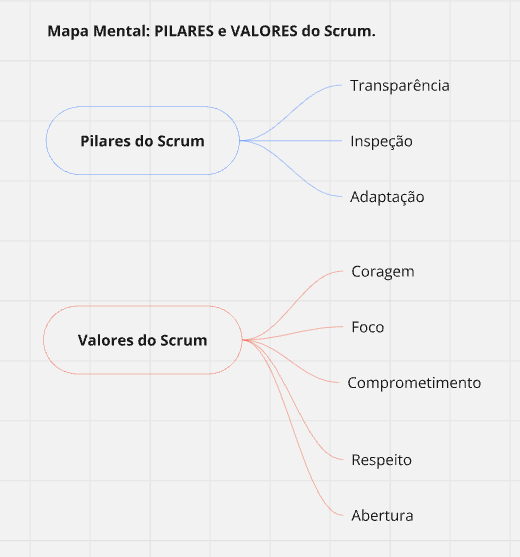
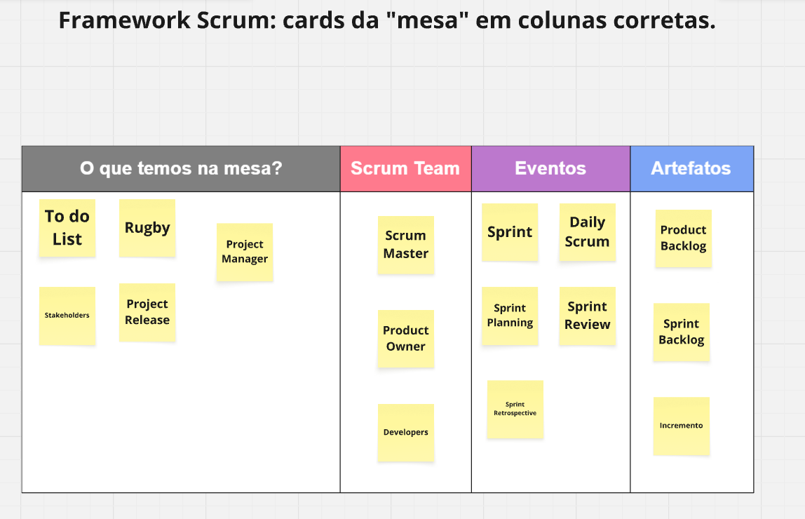
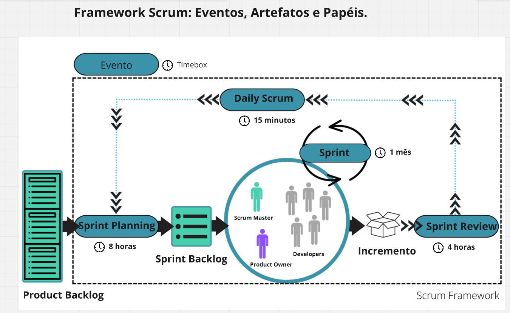

# 🧩 Framework Scrum


> 📌 Resolução do desafio prático de **Scrum**, no qual são preenchidos três esquemas visuais: o mapa mental de **Pilares e Valores**, a classificação de cards entre **Papéis, Eventos e Artefatos** e o diagrama completo do **Framework Scrum**.

---

## 📖 Sobre o Projeto

Este repositório documenta a resolução do desafio **"Framework Scrum"**, proposto em um quadro colaborativo (Miro) com três atividades. O objetivo é consolidar o entendimento sobre a estrutura do Scrum e sobre como seus elementos se conectam entre si.

Todas as respostas seguem o **Scrum Guide 2020** (Ken Schwaber e Jeff Sutherland), a referência oficial do framework.

---

## 🎯 Objetivos de Aprendizagem

- ✅ Identificar os **3 Pilares** e os **5 Valores** do Scrum
- ✅ Diferenciar **Papéis**, **Eventos** e **Artefatos**
- ✅ Reconhecer o que **não** faz parte do Scrum (as "pegadinhas" do desafio)
- ✅ Entender o fluxo completo de uma Sprint e o **timebox** de cada evento
- ✅ Relacionar cada artefato ao seu respectivo **compromisso**

---

## 🗂️ Estrutura do Repositório

```
📁 Scrum Framework
├── 📄 README.md
└── 📁 imagens
    ├── 🖼️ mapa-mental.png           
    ├── 🖼️ mesa-de-cards.png         
    └── 🖼️ framework-scrum.png       
```

---

## 🧠 Atividade 1: Mapa Mental, Pilares e Valores do Scrum

> **TO DO:** Preencha o Mapa Mental com os PILARES e VALORES do Scrum.



### 🏛️ Pilares do Scrum

O Scrum se apoia no **empirismo**: o conhecimento vem da experiência, e as decisões se baseiam no que é observado.

| # | Pilar | Significado |
|---|-------|-------------|
| 1 | **Transparência** | Os aspectos significativos do processo e do trabalho devem estar visíveis a todos os envolvidos no resultado. |
| 2 | **Inspeção** | Os artefatos e o progresso rumo às metas são verificados com frequência, para detectar variações indesejadas. |
| 3 | **Adaptação** | Se algo sair do esperado, o processo ou o produto deve ser ajustado o quanto antes. |

### 💎 Valores do Scrum

| # | Valor | Significado |
|---|-------|-------------|
| 1 | **Coragem** | Ter coragem de fazer a coisa certa e de enfrentar problemas difíceis. |
| 2 | **Foco** | Concentrar-se no trabalho da Sprint e nos objetivos do Time Scrum. |
| 3 | **Comprometimento** | Comprometer-se com o alcance dos objetivos do time. |
| 4 | **Respeito** | Respeitar uns aos outros como pessoas capazes e independentes. |
| 5 | **Abertura** | Estar aberto ao trabalho e aos desafios que surgem. |

---

## 🃏 Atividade 2: Cards da "Mesa" para as Colunas Corretas

> **TO DO:** Movimente os cards da "mesa" para as colunas corretas.



A mesa continha **16 cards**. Onze pertencem ao Scrum e cinco são "pegadinhas".

| 👥 Scrum Team | 🔁 Eventos | 📦 Artefatos |
|---------------|-----------|--------------|
| Scrum Master | Sprint | Product Backlog |
| Product Owner | Sprint Planning | Sprint Backlog |
| Developers | Daily Scrum | Incremento |
| | Sprint Review | |
| | Sprint Retrospective | |

### ⚠️ Cards que ficam na mesa (não pertencem ao Scrum)

| Card | Por que não faz parte do Scrum |
|------|-------------------------------|
| **To Do List** | Não é um artefato do Scrum. O equivalente formal é o Sprint Backlog. |
| **Stakeholders** | Participam e colaboram com o produto, mas não integram o Scrum Team. |
| **Project Release** | Não é um evento nem um artefato. O Scrum entrega valor a cada Sprint, por meio do Incremento. |
| **Rugby** | Origem da metáfora do nome "Scrum" (a formação do time), mas não é um elemento do framework. |
| **Project Manager** | Papel inexistente no Scrum. As responsabilidades são distribuídas entre Product Owner, Scrum Master e Developers. |

---

## 🔄 Atividade 3: Framework Scrum, Eventos, Artefatos e Papéis

> **TO DO:** Preencha o Framework Scrum com todos os Eventos, Artefatos e Papéis.



### 🧭 Fluxo do diagrama

```
Product Backlog ➜ Sprint Planning ➜ Sprint Backlog ➜ [ Sprint: Scrum Team + Daily Scrum ]
                                                              ➜ Incremento ➜ Sprint Review ➜ Sprint Retrospective
                                                                                         ↺ (próxima Sprint)
```

### 🔁 Eventos e Timeboxes

Todos os eventos possuem **duração máxima (timebox)**. Os valores abaixo consideram uma Sprint de 1 mês.

| Evento | Timebox | Propósito |
|--------|---------|-----------|
| **Sprint** | 1 mês ou menos | Evento contêiner que envolve todos os outros. É onde a ideia vira valor. |
| **Sprint Planning** | Até 8 horas | Define **por que** a Sprint é valiosa, **o que** será feito e **como**. |
| **Daily Scrum** | 15 minutos | Inspeciona o progresso rumo ao Sprint Goal e ajusta o plano do dia. |
| **Sprint Review** | Até 4 horas | Inspeciona o resultado da Sprint e define adaptações no Product Backlog. |
| **Sprint Retrospective** | Até 3 horas | Planeja formas de aumentar a qualidade e a eficácia do time. |

> 📝 O diagrama original trazia balões apenas para Sprint Planning, Daily Scrum, Sprint e Sprint Review. A **Sprint Retrospective** foi incluída aqui por ser um dos cinco eventos oficiais do Scrum, encerrando a Sprint após a Review.

### 📦 Artefatos e Compromissos

Cada artefato possui um **compromisso** associado, que traz foco e transparência ao progresso.

| Artefato | Descrição | Compromisso |
|----------|-----------|-------------|
| **Product Backlog** | Lista ordenada de tudo o que é necessário para melhorar o produto. | **Product Goal** (Meta do Produto) |
| **Sprint Backlog** | Itens selecionados para a Sprint, mais o plano para entregá-los. | **Sprint Goal** (Meta da Sprint) |
| **Incremento** | Degrau concreto rumo ao Product Goal. É utilizável e atende à Definição de Pronto. | **Definition of Done** (Definição de Pronto) |

### 👥 Papéis (Scrum Team)

| Figura no diagrama | Papel | Responsabilidade |
|--------------------|-------|------------------|
| 🟢 Verde | **Scrum Master** | Garante que o Scrum seja entendido e aplicado, e remove impedimentos. |
| 🟣 Roxa | **Product Owner** | Maximiza o valor do produto e gerencia o Product Backlog. |
| ⚪ Cinza (grupo) | **Developers** | Criam qualquer aspecto de um Incremento utilizável a cada Sprint. |

---

## 📋 Resumo das Respostas

| Categoria | Itens |
|-----------|-------|
| **Pilares** | Transparência, Inspeção, Adaptação |
| **Valores** | Coragem, Foco, Comprometimento, Respeito, Abertura |
| **Papéis** | Product Owner, Scrum Master, Developers |
| **Eventos** | Sprint, Sprint Planning, Daily Scrum, Sprint Review, Sprint Retrospective |
| **Artefatos** | Product Backlog, Sprint Backlog, Incremento |
| **Fora do Scrum** | To Do List, Stakeholders, Project Release, Rugby, Project Manager |

---

## 🛠️ Metodologia

1. 📖 Estudo do **Scrum Guide 2020** como fonte principal.
2. 🧩 Preenchimento dos três esquemas no quadro colaborativo.
3. 🔍 Revisão de cada resposta, com correção de rótulos, timeboxes e posicionamento dos elementos.
4. 📝 Documentação do resultado neste README.

---

## 📚 Fontes e Referências

- Schwaber, K.; Sutherland, J. **The Scrum Guide** (2020). Disponível em [scrumguides.org](https://scrumguides.org/scrum-guide.html)
- Material e plataforma do desafio de projeto (DIO)

---

## 👤 Carlos Alexandre

Feito com 🧠 e ☕ como parte de estudos em **Metodologias Ágeis e Scrum**.

---

## 📄 Licença

Este projeto está sob a licença MIT.